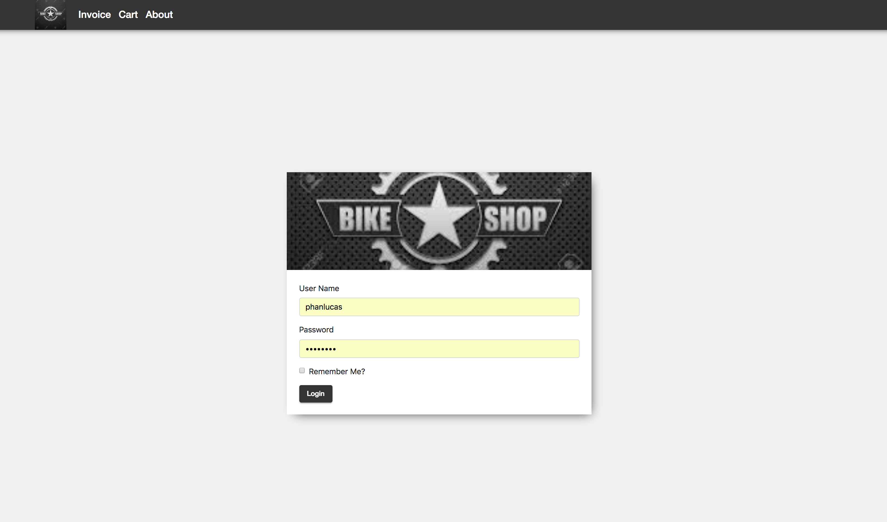
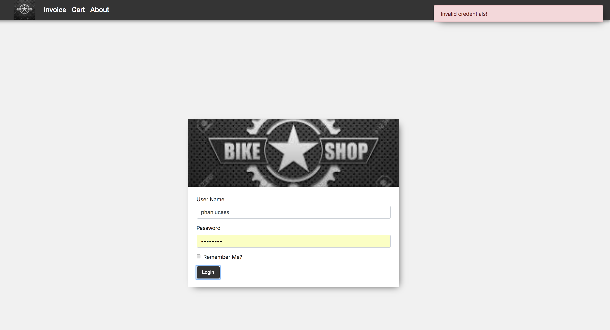
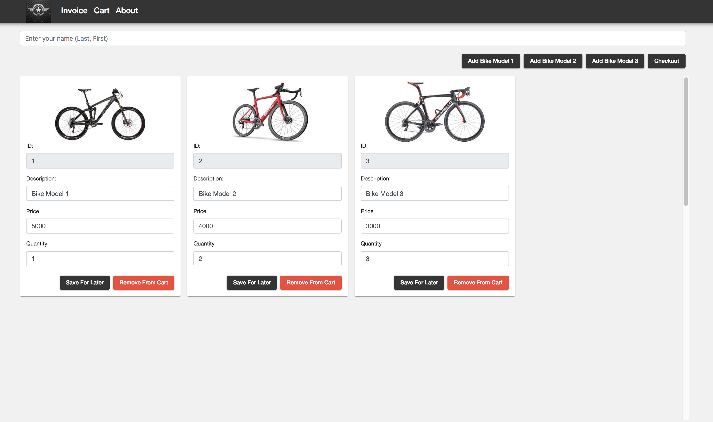
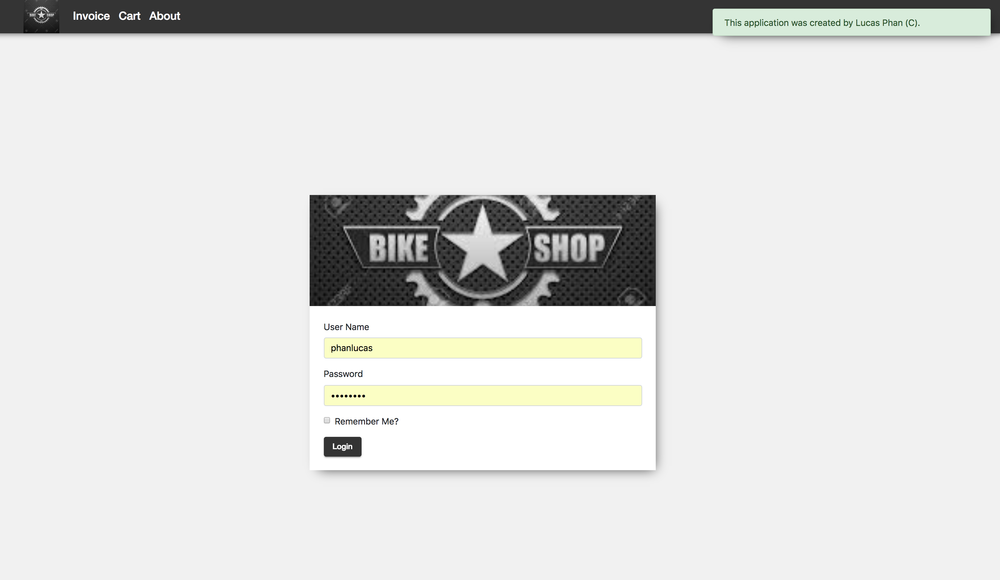
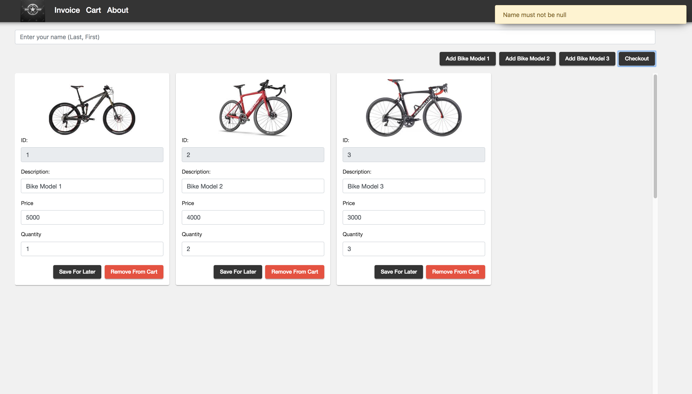
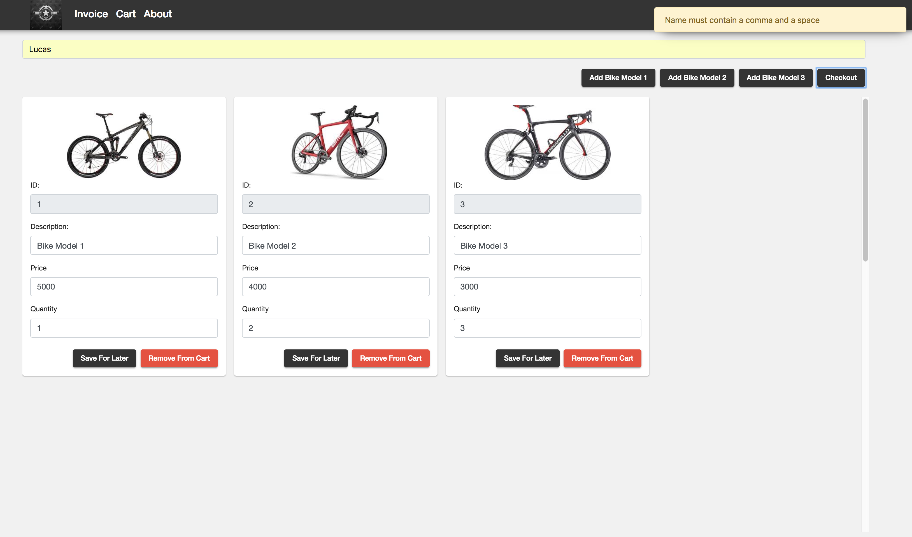
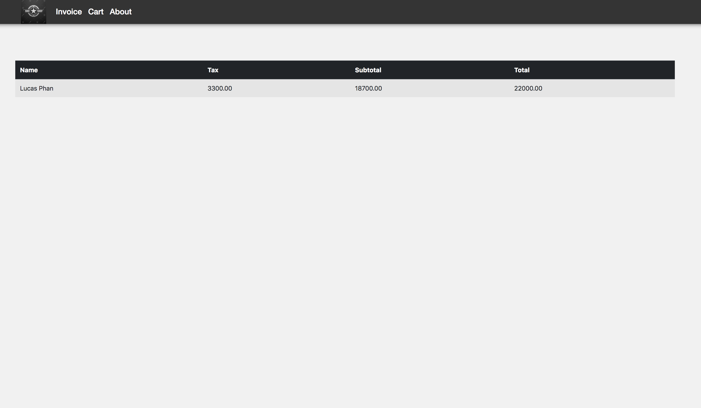

# Specialty Bike Application

## Development server

Run `ng serve` for a dev server. Navigate to `http://localhost:4200/`. The app will automatically reload if you change any of the source files.

## Instructions

### Computer Solution Problem (250 points)

1. Written component 50pts (~ 15 minutes)
2. GITFlow component 50pts (~ 10 minutes)
3. Code component 150pts (~ 85 minutes)

You can use any resources including  your books, notes, and memos for completing this part of the test; however, you cannot ask, share, or consult with anyone in the world. You can use the Internet for any searches. Any violation will automatically issue a zero on the Exam.

The GUI for the application is fully provided for you and you should not have to write any CSS or new HTML elements. Pull the application source code as specified according to the GITFlow section of this exam. Change html of the components items and write all necessary codes and complete the application.

Push all the files to your GITHub repo and change name of the top folder to “IS51Final” (corresponding to your GITHub repo) upon completion of test.

Make sure the computer, VS Code, and the files / application is all working properly with no errors or warnings.

### Code Component - Specialty Bike Application

You are hired to create a web application to sell specialty bikes. The application should have a collection of bikes that stores the following data: ID (a number), image (a string) quantity (a number), price (a number) and description (a string). Currently the company offer three bike model (data as shown below) The application should use an array of three custom objects (interface). If you do not know how to use an array of custom interface, you can use an array of 'any' objects instead with 2.5 points penalty.

#### Exam Data
```
[{
    "id": 1,
    "image": "../../assets/bike1.jpeg",
    "description": "Bike Model 1",
    "price": 5000,
    "quantity": 1
  },
  {
    "id": 2,
    "image": "../../assets/bike2.jpeg",
    "description": "Bike Model 2",
    "price": 4000,
    "quantity": 2
  },
  {
    "id": 3,
    "image": "../../assets/bike3.jpeg",
    "description": "Bike Model 3",
    "price": 3000,
    "quantity": 3
  }]
```

The data above is located in ```assets/inventory.json``` for reference. 

The application will start in the login component. The user enters his or her username and password and login. Currently there is only one user (you) with the default username of password of 

```
username: "<First Name>"
password: "<First Name>123"

eg. lucas, lucas123
```

Upon successful login, navigate to the cart page.

Your application should allow the user to enter data for each item. When the "cart" page is initialized, check and load items from local storage. If there are items available, load the items into the view. If there are no items available in local storage, load the three bike data from the inventory.json file and display them into the view. The user will enter any "price" and "quantity" for each item. When “Checkout” button is clicked, Aggregate (sum up) and calculate the total, subtotal and tax amount.


the "About" button displays a message, ```“This application is designed by <your name>. (C) 2018”``` in a “toast” ToastService (provided) or use an alert box less points.

The user enters his/her name in the name input box (Note: the format of name input ->; Lastname, Firstname; ex: Phan, Lucas). (comma with space between last name and first name) 

When "Remove From Cart" button is clicked, the corresponding item will be deleted.

When “Checkout” button is clicked, validate the name input box is not null or whether a comma and a space ie (', ') is not present. If there are errors, show a toast to the user of the error. Upon successful validation, navigate to the "Invoice" page and display the results as show below. Perform string splicing to transform “LastName, FirstName” to “First Name Last Name” and the name property on the table should show: “<First Name> <Last Name>. (See screenshots)

### Validation (see screenshots below)

1. Name input field not specified (null or '').
2. Name not containing a “, ”.
3. Login validation failed (username and/or password not specified)
4. Login validation failed (username and/or password not matching default user credentials)

### Add Additional Items

The "Add Bike Model 1", "Add Bike Model 2" and "Add Bike Model 3" buttons should add a new empty item into the view. The quantity property is default to 1.

### Delete Item

When the delete button is pressed, delete the corresponding item from the list.

### Save Item

When the save button is pressed, save the items to local storage and display a toast 'Success: Items saved!'.

### Login Page


### Login Page Validation Error


### Cart Page (after loading items from inventory.json or from local storage)


### About Toast (show on About button pressed)


### Validation Errors





### Invoice Page (Home Component) (displaying data computed from the Cart page)


## Points Breakdown

1. Show a toast or an alert showing about text when the "About" link is pressed 6 pts
2. convert name from <Last Name>, <First Name> to <First Name> <Last Name> and display text 15 pts
3. Aggregate and Calculate total, subtotal and and tax amount 15 pts
4. perform input validation 15 pts (total of items below)
  ```
1. Name input field not specified. 3.75 pts
2. Name not containing a “, ”. 3.75 pts
3. Login validation failed (username and/or password not specified) 3.75 pts
4. Login validation failed (username and/or password not matching default user credentials) 3.75 pts
  ```
5. Save the items to local storage when the "Save" button is clicked 15 pts
6. Add corresponding bike items when the "Add Bike Model X" button is clicked 15 pts
7. Delete corresponding item when the "delete" button is clicked 15 pts
8. Read in the inventory.json file and populate the list table with the initial bikes (3) 15 pts
9. Read items from local storage and display the items into the view 15 pts
10. Display calculated results on the home page (see screenshot) 24 pts
11. Login Page submit button Logging in user